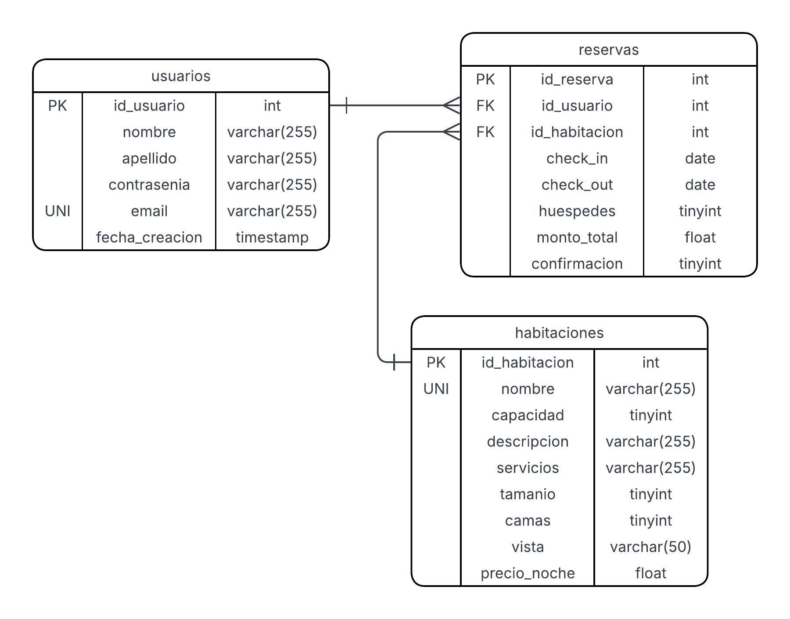

### Trabajo Práctico Final - Introducción al Desarrollo de Software (TB022)

___

#### Objetivo
El siguiente documento presenta el proceso de desarrollo de un sitio web orientado a la oferta de servicios de hospedaje turístico. El trabajo aborda el diseño, implementación y despliegue de una aplicación web completa que integra frontend, backend y base de datos, cumpliendo con los requerimientos establecidos por la cátedra según el [enunciado](https://drive.google.com/file/d/1FfM5XQMQ7ZnDb4-c2Ouqr26giWtWo_vv/view?usp=sharing) provisto.

___

#### Integrantes
El proyecto fue desarrollado por el equipo autodenominado **Ingeniando el Software**, que colaboró de manera coordinada en todas las etapas del proceso; desde la planificación de tareas, contribuciones en el repositorio, revisiones de código y resolución de problemas técnicos, garantizando así una distribución equilibrada de responsabilidades a lo largo del desarrollo.

|        Nombre y Apellido        | Padrón |     GitHub     |   Discord    |
|:-------------------------------:|:------:|:--------------:|:------------:|
|  Camila Vanina Perez Berrocal   | 112941 |    camietc     |   camietc    |
|          Cerbero Diaz           | 110567 |   abecediaz    |  abecediaz   |
|         Dylan Ian Ruiz          | 114346 | Dylan-Ian-Ruiz |   dylux_6    |
| Janely Alejandra Bejarano Muñoz | 112391 |  alejandrabej  | alejandrabej |
|     Lucas Nicolás Luis Roda     | 114402 | LucasRodaFiuba |   omninirl   |
|  Mariano Ignacio Molloja Pinto  | 114770 | marianoignacio |  nannchito   |

___

#### Resumen
El proyecto consistió en el desarrollo de una plataforma web destinada a la gestión de hospedajes turísticos, con funcionalidades de visualización de las habitaciones, creación de reservas, consultas sobre las mismas y el envío de información por mail al usuario. El trabajo se llevó a cabo mediante una organización basada en las metodologías ágiles con [sprints semanales](https://docs.google.com/document/d/11ILOqLO49mzFOHbU7sDN6O1LhaDBNkVpdQgMwG68uuc/edit?usp=sharing) todos los domingos desde el inicio del proyecto, que permitieron avanzar de forma incremental desde la planificación inicial hasta la integración final, garantizando siempre mantener un enfoque claro sobre la entrega-valor semanal.

* En el Sprint 1 se estableció la estructura organizativa, las reglas de negocio, el Backlog y un primer mockup de la aplicación web.
* En el Sprint 2 se creó el repositorio y se avanzó con el desarrollo de las vistas HTML y la definición del flujo de las mismas.
* En el Sprint 3 se consolidó el diseño del frontend, se definieron las tablas de la base de datos y se estableció el conjunto de endpoints necesarios para cumplir con los requerimientos solicitados.
* En el Sprint 4 se desarrolló la integración entre el frontend y el backend, el uso de sesiones con Flask-Session y la preparación de los endpoint en Python de la API.

___

#### Solución propuesta
A continuación se listan específicamente los avances realizados en cada sprint, tal como se registraron en las minutas del equipo. Se incluyen las tablas de la base de datos y el listado de endpoints definidos/implementados hasta el momento.

###### Sprint 1 — Organización y planificación inicial

* Como canal de comunicación, se eligió [Discord](https://discord.gg/YXY7EMwm).
* Decisión de trabajo por sprints semanales y reuniones de seguimiento (domingos 21:00hs).
* Para la estrategia de trabajo, cada integrante puede trabajar sobre un mismo requerimiento que incluya front y back para facilitar la integración.
* Se seleccionó la propuesta de hotelería del enunciado provisto por la cátedra.
* [Versión inicial del Backlog](https://github.com/users/LucasRodaFiuba/projects/2/views/1) creada en GitHub Projects (Kanban).
* Desarrollo y diseño del mockup en Figma para las vistas.

###### Sprint 2 — Repositorio, vistas y flujo de trabajo

* El idioma definido para el proyecto será español (commits, variables, issues, ramas).
* [Repositorio](https://github.com/marianoignacio/TPFINAL) creado en GitHub con ramas principales (`main`, `desarrollo`, `requerimiento`).
* [Backlog](https://github.com/users/marianoignacio/projects/2/views/1) finalizado en GitHub con tareas a desarrollar.
* [Mockup](https://www.figma.com/design/n5N7sUcTeC2G3wwzexmv6j/TPFINAL?node-id=0-1&t=gphFE0uqLL31qqPK-1) en Figma como referencia visual para las vistas.
* Estado de vistas (plan y asignación):
  * Vistas a modificar: `index`, `sobre_nosotros`, `contacto`, `habitacion`. 
  * Vistas a desarrollar desde cero: `inicio_sesion`, `registrarse`, `perfil`, `reserva`, `pago`, `404`, `confirmacion_pago`.
* Asignación de vistas por integrante:
  * Camila: `404`, `Pago`. 
  * Cerbero: `Inicio de Sesión`, `Registrarse`. 
  * Dylan: `Index`. 
  * Janely: `Sobre Nosotros`, `Habitación`. 
  * Lucas: `Reserva`, `Confirmación de Pago`. 
  * Mariano: `Contacto`, `Perfil`.

###### Sprint 3 — Front, tablas SQL y definición de endpoints

* Vistas creadas (primera versión):
  * Finalizados: `index.html`, `contacto.html`, `registro.html`, `inicio_sesion.html`, `pago.html`, `404.html`, `confirmacion_pago.html`. 
  * Pendientes: `sobre_nosotros.html`, `habitacion.html`, `reserva.html`.
* Definición final de las tablas para la base de datos, diagrama de entidad-relación y reglas de negocio.

* Se desarrolló el script de creación (con datos dummy para pruebas).
* Reglas de negocio resumidas:
  * La cantidad de huéspedes en la reserva no puede superar la capacidad de la habitación.
  * `monto_total = (check_out - check_in) * habitaciones.precio_noche`
  * Emails únicos en usuarios. 
  * Contraseñas hasheadas con SHA-256. 
  * Servicios almacenados como lista.s

Tabla: **reservas**

| Campo         | Tipo    | Not Null | AI | Key | Descripción                       |
|---------------|---------|---------:|:--:|:---:|-----------------------------------|
| id_reserva    | int     |       Sí | Sí | PK  | Identificador único de la reserva |
| id_usuario    | int     |       Sí | No | FK  | FK → usuarios.id_usuario          |
| id_habitacion | int     |       Sí | No | FK  | FK → habitaciones.id_habitacion   |
| check_in      | date    |       Sí | No |     | Fecha de inicio (YYYY/MM/DD)      |
| check_out     | date    |       Sí | No |     | Fecha de fin (YYYY/MM/DD)         |
| huespedes     | tinyint |       Sí | No |     | Cantidad de huéspedes             |
| monto_total   | float   |       Sí | No |     | Monto calculado de la reserva     |

Tabla: **usuarios**

| Campo          | Tipo         | Not Null | AI | Key | Descripción                                  |
|----------------|--------------|---------:|:--:|:---:|----------------------------------------------|
| id_usuario     | int          |       Sí | Sí | PK  | Identificador único                          |
| nombre         | varchar(255) |       Sí | No |     | Nombre del usuario                           |
| apellido       | varchar(255) |       Sí | No |     | Apellido                                     |
| contrasenia    | varchar(255) |       Sí | No |     | Contraseña hasheada (SHA-256)                |
| email          | varchar(255) |       Sí | No | UNI | Email único                                  |
| fecha_creacion | timestamp    |       Sí | No |     | Fecha/hora de creación (YYYY/MM/DD HH:MM:SS) |

Tabla: **habitaciones**

| Campo         | Tipo         | Not Null | AI | Key | Descripción                          |
|---------------|--------------|---------:|:--:|:---:|--------------------------------------|
| id_habitacion | int          |       Sí | Sí | PK  | Identificador de habitación          |
| nombre        | varchar(255) |       Sí | No | UNI | Nombre único (family, classic, etc.) |
| capacidad     | tinyint      |       Sí | No |     | Capacidad máxima (≤10)               |
| descripcion   | varchar(255) |       Sí | No |     | Descripción y amenities              |
| servicios     | varchar(255) |       Sí | No |     | Lista/JSON de servicios              |
| tamanio       | tinyint      |       Sí | No |     | M² de la habitación                  |
| camas         | tinyint      |       Sí | No |     | Cantidad de camas                    |
| vista         | varchar(50)  |       Sí | No |     | Descripción de la vista              |
| precio_noche  | float        |       Sí | No |     | Precio por noche                     |

* Endpoints definidos:

| Método | Ruta                              | Descripción                 | Implementado |
|--------|-----------------------------------|-----------------------------|:------------:|
| GET    | `/usuarios`                       | Trae todos los usuarios     |      ❌       |
| GET    | `/usuarios/<id_usuario>`          | Trae un usuario             |      ✅       |
| GET    | `/usuarios/<id_usuario>/reservas` | Trae reservas del usuario   |      ✅       |
| POST   | `/usuarios/<email>`               | Crea usuario con email      |      ✅       |
| POST   | `/usuarios/<id_usuario>/reservas` | Crea reserva para usuario   |      ✅       |
| PUT    | `/usuarios/<id_usuario>`          | Actualiza usuario           |      ❌       |
| DELETE | `/usuarios/<id_usuario>`          | Elimina usuario             |      ❌       |
| DELETE | `/usuarios/<id_usuario>/reservas` | Elimina reservas de usuario |      ❌       |
| GET    | `/habitaciones`                   | Trae todas las habitaciones |      ✅       |
| GET    | `/habitaciones/<id_habitacion>`   | Trae habitación por id      |      ✅       |
| POST   | `/habitaciones/<nombre>`          | Crea habitación             |      ❌       |
| PUT    | `/habitaciones/<id_habitacion>`   | Actualiza habitación        |      ❌       |
| DELETE | `/habitaciones/<id_habitacion>`   | Elimina habitación          |      ❌       |
| GET    | `/reservas`                       | Trae todas las reservas     |      ❌       |
| GET    | `/reservas/<id_reserva>`          | Trae reserva por id         |      ✅       |
| PUT    | `/reservas/<id_reserva>`          | Actualiza reserva           |      ❌       |
| DELETE | `/reservas/<id_reserva>`          | Elimina reserva             |      ❌       |

###### Sprint 4 — Integración front-back, Flask-Session y endpoints
* Organización de presentaciones para el orden de oratoria para reuniones de presentación y reparto equitativo de temas.
* Completar el desarrollo de endpoints restantes para permitir la integración real con el frontend.
* Se decidió integrar Flask-Session para que el inicio de sesión del usuario persista entre vistas.
* CAmbios decididos:
  * Modularizar vistas con base.html y Jinja para unificar navbar y footer. 
  * Implementar llamadas desde las vistas a los endpoints del backend para requerimientos de inicio de sesión, registro, consulta de habitaciones y creación de reservas. 
  * Implementar Flask-Mail para envío de confirmación/recibos de reserva al usuario.
* Tareas de pulido:
  * Revisión de enlaces y rutas en las vistas. 
  * Finalizar endpoints en Python y pruebas de integración. 
  * Reparar carousel en habitacion.html, indicadores de vista activa en navbar, y dinamización de elementos.

Tecnología Utilizada
* HTML, CSS, JavaScript (desarrollo y diseño de las vistas)
* Flask (frontend y backend)
* Jinja (modularización del código)
* Flask-Mail (envío de correos en flujos de confirmación)
* Flask-Session (lógica de la sesión)
* Figma (diseño del mockup)
* MySQL (base de datos)
* GitHub (repositorio y ramas)
* GitHub Projects (tablero Kanban y gestión del Backlog)
* Discord (comunicación interna del equipo)

## Tecnología utilizada

* **Python**
* **Flask** (servidor backend, ruteo, controladores)
* **Flask-Session** (persistencia de sesión)
* **Flask-Mail** (envío de correos en flujos de confirmación)
* **Jinja2** (motor de plantillas para vistas HTML)
* **HTML5 / CSS3 / JavaScript** (estructura, estilos y comportamiento del frontend)
* **Figma** (diseño de mockups y prototipos visuales)
* **Canva** (bocetos iniciales de la interfaz)
* **MySQL / MariaDB** (base de datos relacional)
* **GitHub** (gestión de repositorio, issues, ramas y versionado)
* **GitHub Projects** (tablero Kanban y gestión del backlog)
* **Swagger / OpenAPI** (documentación de endpoints)
* **Discord** (comunicación interna del equipo)

---

## Conclusiones

Se logró desarrollar una aplicación web de hotelería con backend, base de datos y vistas. El trabajo por sprints permitió organizar las tareas y a los integrantes de forma semanal, teniendo siempre como enfoque la entrega-valor. A pesar de algunas dificultades con GitHub (principalmente en el manejo de ramas y resolución de conflictos) el equipo logró establecer un flujo de trabajo ordenado y colaborativo. La metodología adoptada favoreció el orden y permitió resolver problemas de forma ágil, pudiendo abarcar a tiempo los cambios sugeridos por el tutor o por los propios integrantes.